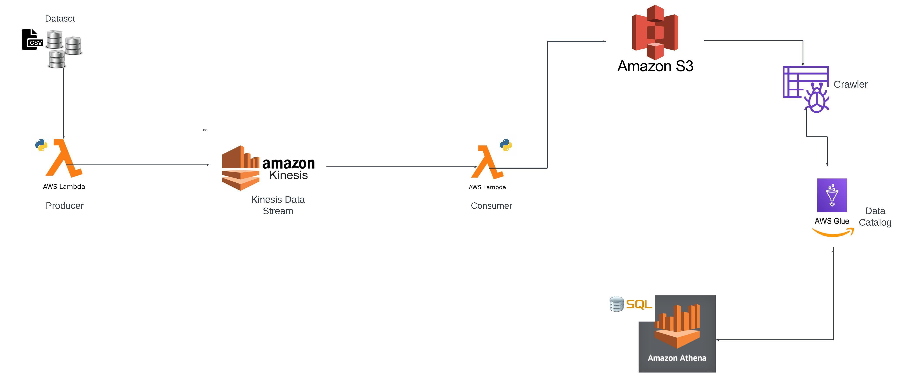

# Leveraging Kinesis Data Stream for Real-Time Stock Data Analysis Project

## Introduction

In this project, I executed an End-To-End Data Engineering Project on Real-Time Stock Market Data using Kinesis Data Stream.

I have used different technologies such as Python, Amazon Web Services (AWS), Kinesis Data Stream, Lambda, Glue, Athena, and SQL

## Architecture 

## Technology Used
- Programming Language - Python
- Amazon Web Service (AWS)
  
1. S3 (Simple Storage Service)
2. Athena
3. Glue Crawler
4. Glue Catalog
5. kinesis Data Stream
6. Lambda
   
## Dataset Used

https://github.com/teja-madire-BigData/Leveraging-Kinesis-Data-Stream-for-Real-Time-Stock-Data-Analysis-Project/blob/main/Stock_market_Data.csv

## Steps to build the project

## 1)Create a Kinesis Data Stream:

    -Go to the AWS Management Console and navigate to the Kinesis service.
    -Click on "Create data stream" and provide a name for your stream (e.g., "stock_market_streaming_realtime").
    -Configure the desired number of shards for your stream.
    -Click on "Create data stream" to create the stream.

## 2)Create an S3 Bucket:

    -Go to the AWS Management Console and navigate to the S3 service.
    -Click on "Create bucket" and provide a unique name for your bucket.
    -Configure the desired settings for your bucket, such as region and access permissions.
    -Click on "Create bucket" to create the S3 bucket.
    

## 3)Create the Producer Lambda Function:  

    -Go to the AWS Management Console and navigate to the Lambda service.
    -Click "Create function" and select "Author from scratch".
    -Provide a name for your function (e.g., "stock_market_producer").
    -Select the desired runtime environment (e.g., Python 3.10).
    -Choose or create an execution role with the necessary permissions for accessing S3 and Kinesis.
    -Increase the function's timeout to more than 1 minute (default is 3 seconds) to accommodate the time required for processing.
    -Add the AWSSDKPandas-Python310 layer to your function for Pandas support.
    -Write or copy your producer Lambda function code into the code editor.
    -Save the function.

    
## 4)Create the Consumer Lambda Function:

    -Go to the AWS Management Console and navigate to the Lambda service.
    -Click "Create function" and select "Author from scratch".
    -Provide a name for your function (e.g., "stock_market_consumer").
    -Select the desired runtime environment (e.g., Python 3.10).
    -Choose or create an execution role with the necessary permissions to access S3 and Kinesis.
    -Configure the event source trigger for the function and select Kinesis as the source.
    -Choose the Kinesis data stream you created earlier as the source stream.
    -Write or copy your consumer Lambda function code into the code editor.
    -Save the function.
    -Now run the producer code it will send the data to the kinesis data stream and then it triggers the lambda function and which will send 
     the data to s3 in real-time

     
## 5)Create a Crawler in Glue:

    -Go to the AWS Management Console and navigate to the AWS Glue service.
    -Click on "Crawlers" and then "Add crawler" to create a new crawler.
    -Provide a name for the crawler (e.g., "stock_market_crawler").
    -Select the data source as your S3 bucket.
    -Configure the crawler to create a schema for the crawled data.
    -Optionally, set up a schedule for running the crawler periodically.
    -Run the crawler to generate the schema based on the data in your S3 bucket.

    
## 6)Use Athena for Analysis:
    
    -Go to the AWS Management Console and navigate to the Amazon Athena service.
    -Create a new query and select the database created by the crawler.
    -Write SQL queries to analyze the data in your S3 bucket using Athena.
    -Execute the queries and visualize or export the results as needed.

This updated process outlines the steps to create a Kinesis Data Stream, S3 bucket, producer and consumer Lambda functions, a crawler in Glue, and use Athena for data analysis. Make sure to configure the permissions and settings according to your specific requirements and adjust the code in the Lambda functions accordingly.

## Here are a few basic queries you can use in Athena to analyze the stock market data you provided:

1)Calculate the average closing price for each index:

SELECT Index, AVG(Close) AS AverageClosingPrice
FROM your_table
GROUP BY Index

2)Find the highest and lowest closing prices for a specific index:

SELECT Index, MAX(Close) AS HighestClosingPrice, MIN(Close) AS LowestClosingPrice
FROM your_table
WHERE Index = 'HSI'
GROUP BY Index

3)Determine the trading volume for a specific date range:

SELECT Date, SUM(Volume) AS TotalVolume
FROM your_table
WHERE Date BETWEEN '1987-01-01' AND '1987-01-31'
GROUP BY Date
ORDER BY Date

4)Calculate the average trading volume by an index for a specific date range:

SELECT Index, AVG(Volume) AS AverageVolume
FROM your_table
WHERE Date BETWEEN '1987-01-01' AND '1987-01-31'
GROUP BY Index

5)Find the top 5 dates with the highest trading volume:

SELECT Date, SUM(Volume) AS TotalVolume
FROM your_table
GROUP BY Date
ORDER BY TotalVolume DESC
LIMIT 5

    
    

      
